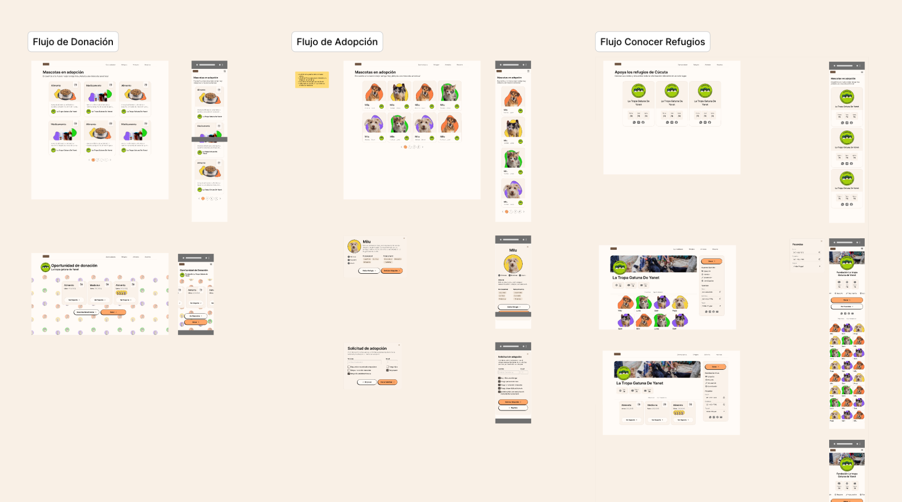

Cuida es un proyecto diseñado para mejorar la visibilidad y el apoyo a los refugios de animales en mi ciudad. Este proyecto representa un esfuerzo integral de investigación, diseño y desarrollo, aplicando metodologías modernas como el design thinking para crear una solución digital que no solo es funcional, sino también, pretende impactar en la vida de los animales y las personas involucradas.

## Inspiración del Proyecto

Cuida nació inspirado por [PetFinder](https://www.petfinder.com/), una plataforma enfocada en la adopción de mascotas en Estados Unidos. Al descubrirla, pensé en adaptar esta idea a mi ciudad, donde noté una falta de iniciativas similares. Realicé una investigación de mercado inicial para identificar plataformas existentes, como [RSPCA](https://www.adoptapet.com.au/), [AdoptaNoCompres](https://www.adoptanocompres.org/conocelos-aqui/), y [AdoptaPet](https://www.adoptapet.com.au/), todas ubicadas en países desarrollados. Esto me permitió entender mejor el diseño y las funcionalidades predominantes en el mercado global.

Además, descubrí múltiples refugios locales como [Refugio Naty Sanchez](https://www.instagram.com/refugioanimalnattysanchez/), [Salvamento Animal](https://www.instagram.com/salvamento_ventadegaraje/) y [La tropa gatuna de Yanet](https://www.instagram.com/latropagatunadeyane/), que enfrentan desafíos en visibilidad y financiamiento. Así, decidí crear Cuida, una plataforma que ayudaría a los refugios a aumentar su visibilidad y mejorar sus ingresos.

## Desafíos y Oportunidades

Inicialmente, planteé abarcar varios servicios: donación, adopción, compra de productos y contacto, con un enfoque principal en la adopción.

La idea era que los habitantes de Cúcuta pudieran explorar qué mascotas estaban disponibles para adopción en una experiencia rápida y agradable.

## Proceso de Diseño y Entrevistas

Después de desarrollar el primer prototipo, realicé entrevistas con refugios, siguiendo las pautas del curso de UX Research de UXCEL. Estas entrevistas, como la realizada con el [Refugio Naty Sanchez](https://www.instagram.com/refugioanimalnattysanchez/), me permitieron comprender mejor los desafíos que enfrentan los refugios. Descubrí que la adopción no era su principal preocupación; en cambio, su mayor reto era la falta de ingresos consistentes, lo que los llevaba a depender de rifas y donaciones ocasionales.

caption: Fotos tomadas en el Refugio Animal Naty Sanchez, momentos después de haber realizado la entrevista

Esta información fue crucial para iterar en el proyecto, enfocándome en las verdaderas necesidades de los refugios. Sin embargo, por razones personales, el proyecto fue pausado durante un año.

## Prototipado y Desarrollo del MVP

El siguiente paso fue desarrollar un MVP que abordara las necesidades más urgentes: visibilizar los refugios y sus animales. Con la colaboración de la Universidad Simón Bolívar y un equipo de estudiantes de Ingeniería de Sistemas, del cual formaba parte mi amigo Rocky, creamos la primera versión Beta de Cuida. Yo me encargué del frontend y la experiencia de usuario, mientras que Rocky desarrolló un CMS con Strapi.

Aunque cometí el error de no definir un design system desde el principio, cada página del sitio tenía un propósito claro: desde la landing page que invita a la acción, hasta los detalles de donación que motivan al visitante a contribuir. Además, aseguré que todo fuera responsive y accesible.

## Design System y Revisión

Al darme cuenta de la falta de consistencia en el diseño, realicé una auditoría UX/UI para establecer un design system y rediseñar la plataforma por completo. Claro está, después de una debida investigación para empezar con el pie derecho.

El resultado fue un diseño más coherente y profesional que refleja los valores de la marca y permite un escalado eficiente gracias al uso del atomic design.

## Resultados y Lecciones Aprendidas

Cuida es ahora un producto real que transmite profesionalismo y los valores de la marca. El proceso de desarrollo me enseñó la importancia de la investigación de usuarios, la necesidad de iterar con base en feedback real, y la capacidad de trabajar en equipo para superar desafíos técnicos y de diseño. Este proyecto no solo me ha permitido mejorar mis habilidades en UX/UI y desarrollo frontend, sino que también ha tenido un impacto positivo en la comunidad de refugios locales.
